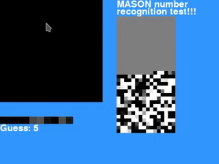

### MASON - A bare-bones neural network implementation.

At the moment this is just a test I'm playing around with, so if you're looking for a ML framework to use you're 100000% better off using something built for performance instead of for fun.
This is based off the machine learning videos by StatQuest and 3blue1brown. Check them out!
